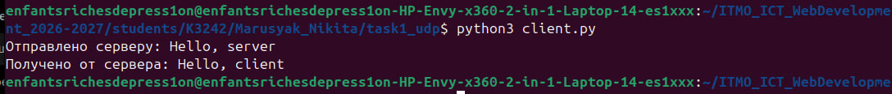
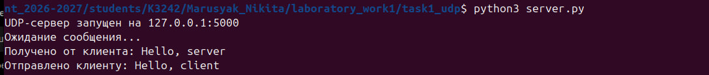
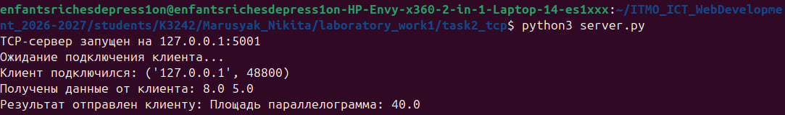
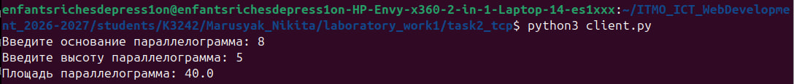
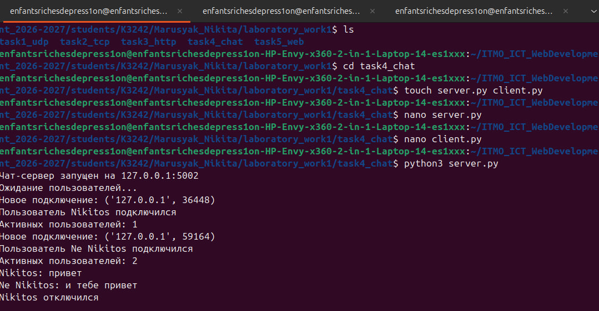
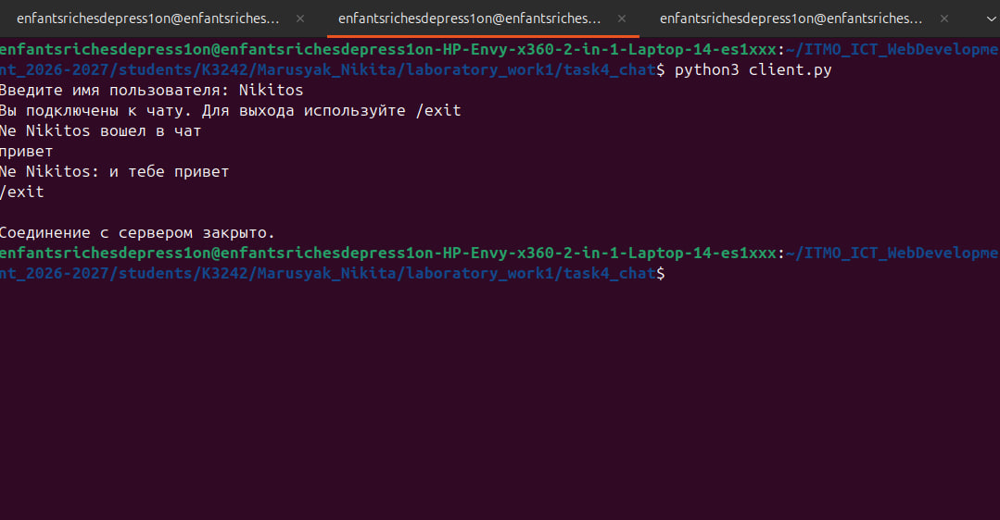
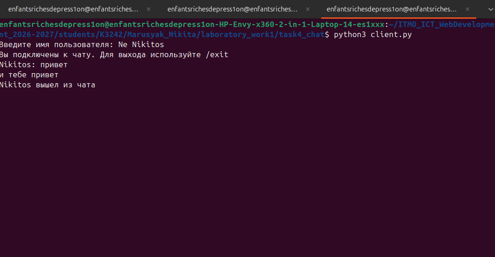
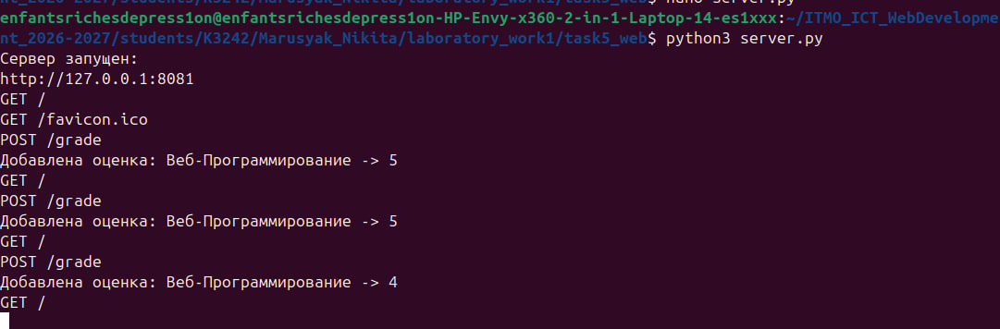
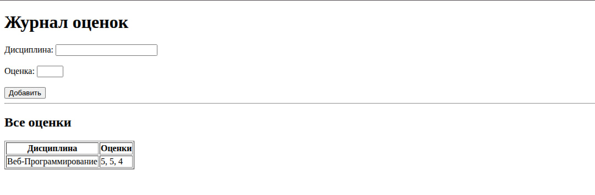
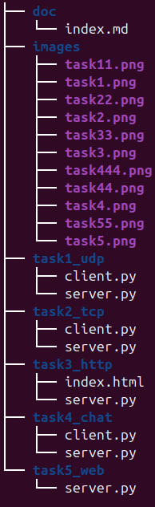

# Лабораторная работа №1

## Цель работы

Изучить принципы межсокетного взаимодействия в вебе и научиться реализовывать базовую клиент-серверную архитектуру с использованием библиотеки `socket` в Python.

В ходе работы необходимо реализовать обмен данными по протоколам UDP и TCP, простой HTTP-сервер, многопользовательский чат и веб-сервер с поддержкой GET и POST запросов.

---

## Практическое задание 1. Обмен сообщениями по UDP

В первом задании была реализована клиентская и серверная часть приложения с использованием библиотеки `socket` и протокола UDP.

Для создания UDP-сокета использовался тип:

```python
socket.SOCK_DGRAM
```

Сервер был запущен на локальном IP-адресе `127.0.0.1` и порту `5000`.

Клиент отправляет серверу сообщение:

```text
Hello, server
```

Для отправки сообщения используется метод `sendto()`.

Сервер принимает сообщение с помощью метода `recvfrom()`.

После получения сообщения сервер выводит его в терминал и отправляет клиенту ответ:

```text
Hello, client
```

Клиент получает ответ от сервера и также выводит его в терминал.

Таким образом, был реализован двусторонний обмен сообщениями по протоколу UDP.




---

## Практическое задание 2. Вычисления через TCP

Во втором задании была реализована клиентская и серверная часть приложения с использованием протокола TCP.

Номер студента в журнале — 20, поэтому был выбран вариант 4 — вычисление площади параллелограмма.

Площадь параллелограмма вычисляется по формуле:

```text
S = a * h
```

где `a` — основание параллелограмма, `h` — высота параллелограмма, `S` — площадь параллелограмма.

Для создания TCP-сокета использовался тип:

```python
socket.SOCK_STREAM
```

На серверной стороне использовались методы `bind()`, `listen()` и `accept()`.

Метод `bind()` привязывает сервер к определенному IP-адресу и порту.

Метод `listen()` переводит сервер в режим ожидания подключений.

Метод `accept()` принимает подключение клиента.

На клиентской стороне для подключения к серверу используется метод `connect()`.

Пользователь вводит основание и высоту параллелограмма с клавиатуры.

Например:

```text
Введите основание параллелограмма: 8
Введите высоту параллелограмма: 5
```

Клиент отправляет введенные значения серверу.

Сервер принимает значения, преобразует их в числа и вычисляет площадь:

```text
8 * 5 = 40
```

После этого сервер отправляет результат обратно клиенту:

```text
Площадь параллелограмма: 40.0
```

Таким образом, вычисление выполняется на сервере, а клиент используется для ввода данных и отображения результата.




---

## Практическое задание 3. Раздача HTML-страницы по HTTP

В третьем задании был реализован простой HTTP-сервер с использованием библиотеки `socket`.

HTML-страница хранится в отдельном файле:

```text
index.html
```

Сервер запускается на локальном адресе `127.0.0.1` и порту `8080`.

После запуска страницу можно открыть в браузере по адресу:

```text
http://127.0.0.1:8080
```

Когда браузер подключается к серверу, он отправляет HTTP-запрос.

Пример запроса:

```text
GET / HTTP/1.1
```

Сервер принимает запрос, считывает содержимое файла `index.html` и формирует HTTP-ответ.

Ответ содержит строку состояния:

```text
HTTP/1.1 200 OK
```

а также заголовки:

```text
Content-Type: text/html; charset=utf-8
Content-Length: ...
Connection: close
```

После HTTP-заголовков передается содержимое HTML-файла.

В результате браузер отображает страницу, полученную от созданного HTTP-сервера.


---

## Практическое задание 4. Многопользовательский чат

В четвертом задании был реализован многопользовательский чат с использованием протокола TCP.

Для сетевого взаимодействия использовалась библиотека `socket`.

Для одновременной обработки нескольких пользователей использовалась библиотека `threading`.

Сервер ожидает подключения клиентов и сохраняет информацию об активных пользователях.

Для каждого нового клиента создается отдельный поток:

```python
threading.Thread
```

Это позволяет нескольким пользователям одновременно подключаться к серверу и обмениваться сообщениями.

При запуске каждый клиент вводит свое имя пользователя.

Например:

```text
Введите имя пользователя: Nikita
```

или:

```text
Введите имя пользователя: Ivan
```

После этого сообщения пользователей имеют вид:

```text
Nikita: Привет!
Ivan: Привет, Nikita!
```

Сервер принимает сообщение одного пользователя и пересылает его другим подключенным клиентам.

Для выхода из чата используется команда:

```text
/exit
```

После ввода этой команды соединение пользователя закрывается, а другим участникам отправляется уведомление о его выходе.

В данной реализации используется один файл `client.py`, который может быть запущен одновременно в нескольких терминалах.






---

## Практическое задание 5. Веб-сервер с обработкой GET и POST запросов

В пятом задании был реализован простой веб-сервер с помощью библиотеки `socket`.

Сервер предназначен для хранения информации о дисциплинах и оценках.

В приложении поддерживаются два типа HTTP-запросов:

```text
GET
POST
```

GET-запрос используется для получения HTML-страницы с журналом оценок.

Пример:

```text
GET /
```

POST-запрос используется для передачи серверу новой дисциплины и оценки.

Пример пути:

```text
POST /grade
```

Для хранения оценок используется словарь.

Пример структуры:

```python
grades = {
    "Математика": [5, 4],
    "Физика": [3, 5]
}
```

Такая структура позволяет хранить несколько оценок для одного предмета.

Например:

```text
Математика: 5, 4, 5
Физика: 4, 3
Программирование: 5
```

Пользователь вводит название дисциплины и оценку в HTML-форме.

После отправки формы браузер передает данные серверу через POST-запрос.

Сервер обрабатывает полученные данные и добавляет оценку к соответствующей дисциплине.

После этого браузер выполняет GET-запрос и получает обновленную HTML-страницу с журналом оценок




---

## Структура проекта

В результате выполнения лабораторной работы была создана следующая структура проекта:

```text
laboratory_work1/
├── task1_udp/
│   ├── server.py
│   └── client.py
├── task2_tcp/
│   ├── server.py
│   └── client.py
├── task3_http/
│   ├── server.py
│   └── index.html
├── task4_chat/
│   ├── server.py
│   └── client.py
├── task5_web/
│   └── server.py
└── docs/
    ├── index.md
    └── images/
        ├── task1.png
        ├── task2.png
        ├── task3.png
        ├── task4.png
        ├── task5.png
        └── structure.png
```



---

## Вывод

В ходе лабораторной работы были изучены основные принципы клиент-серверного взаимодействия с использованием сокетов.

Был реализован обмен сообщениями по протоколу UDP, клиент-серверное приложение по протоколу TCP для выполнения математических вычислений, HTTP-сервер для передачи HTML-страницы, многопользовательский чат с использованием потоков и веб-сервер с поддержкой GET и POST запросов.

Также были изучены основные методы библиотеки `socket`, такие как `bind()`, `listen()`, `accept()`, `connect()`, `send()`, `sendto()`, `recv()` и `recvfrom()`.

В результате выполнения работы были освоены базовые принципы работы сетевых протоколов UDP, TCP и HTTP, а также использование многопоточности для одновременной работы нескольких клиентов.
